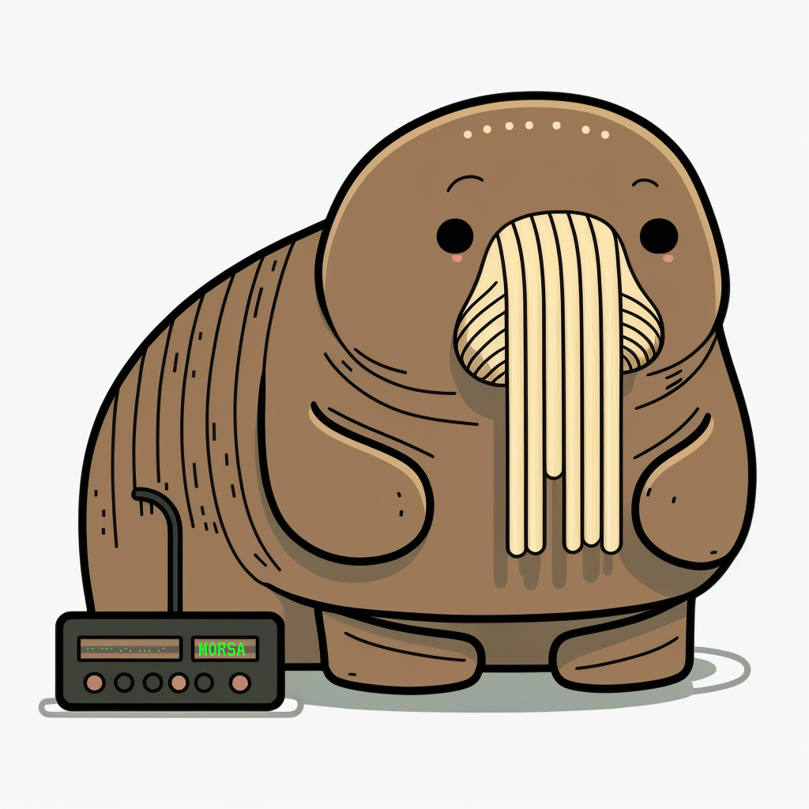

<!-- PROJECT SHIELDS -->
[![Contributors][contributors-shield]][contributors-url]
[![Forks][forks-shield]][forks-url]
[![Stargazers][stars-shield]][stars-url]
[![Issues][issues-shield]][issues-url]
[![MIT License][license-shield]][license-url]


<!-- PROJECT LOGO -->
<br />
<div align="center">
  <a href="https://github.com/agustinhopneto/morsa">
    
  </a>

  <h3 align="center">MORSA</h3>

  <p align="center">
    Just a simple morse code translator.
  </p>
</div>

<!-- ABOUT THE PROJECT -->
## About The Project
MORSA is a very simple library that translates morse code into words or a encodes text into morse code. It doesn't uses any library to do the work, being very small and simple.

### Built With
This section should list any major frameworks/libraries used to bootstrap your project. Leave any add-ons/plugins for the acknowledgements section. Here are a few examples.

* [![TypeScript][TypeScript]][TypeScript-url]

<!-- GETTING STARTED -->
## Getting Started
This is an example of how you may give instructions on setting up your project locally.
To get a local copy up and running follow these simple example steps.

### Installation
  ```
  npm install @agustinhopneto/morsa
  ```

### Running locally
1. Clone the repo
   ```sh
   git clone https://github.com/agustinhopneto/morsa.git
   ```
2. Install NPM packages
   ```sh
   npm install
   ```
3. Run the example
   ```sh
   npm run example
   ```

<!-- USAGE EXAMPLES -->
## API
It's very easy to use MORSA to encode texts and to decode morse code.
```js
const Morsa = require('morsa').default;

const morsa = new Morsa();

morsa.encode('SOS'); // ... --- ...

morsa.decode('-- --- .-. ... .-'); // MORSA
```

Each letter in morse code must be separeted by a space character and each word must be separeted by a slash character.

```js
morse.decode('-- --- .-. ... . / -.-. --- -.. .'); // MORSE CODE
```

If the text or code morse contains an unmapped character, it will be replaced with "#".

```js
morse.encode('Unmapped 🥵'); // ..- -. -- .- .--. .--. . -.. / #
```

<!-- CONTRIBUTING -->
## Contributing

Contributions are what make the open source community such an amazing place to learn, inspire, and create. Any contributions you make are **greatly appreciated**.

If you have a suggestion that would make this better, please fork the repo and create a pull request. You can also simply open an issue with the tag "enhancement".
Don't forget to give the project a star! Thanks again!

1. Fork the project
2. Create your feature branch
  ```sh
  git checkout -b feat/amazing-feature
  ```
3. Commit your changes
  ```sh
  git commit -m 'feat(index): add some amazing feature'
  ```
4. Push to the branch
  ```sh
  git push origin feat/amazing-feature
  ```
5. Open a Pull Request

<!-- LICENSE -->
## License
Distributed under the MIT License. See `LICENSE` for more information.

<!-- MARKDOWN LINKS & IMAGES -->
<!-- https://www.markdownguide.org/basic-syntax/#reference-style-links -->
[contributors-shield]: https://img.shields.io/github/contributors/agustinhopneto/morsa.svg?style=for-the-badge
[contributors-url]: https://github.com/agustinhopneto/morsa/graphs/contributors
[forks-shield]: https://img.shields.io/github/forks/agustinhopneto/morsa.svg?style=for-the-badge
[forks-url]: https://github.com/agustinhopneto/morsa/network/members
[stars-shield]: https://img.shields.io/github/stars/agustinhopneto/morsa.svg?style=for-the-badge
[stars-url]: https://github.com/agustinhopneto/morsa/stargazers
[issues-shield]: https://img.shields.io/github/issues/agustinhopneto/morsa.svg?style=for-the-badge
[issues-url]: https://github.com/agustinhopneto/morsa/issues
[license-shield]: https://img.shields.io/github/license/agustinhopneto/morsa.svg?style=for-the-badge
[license-url]: https://github.com/agustinhopneto/morsa/blob/main/LICENSE

[TypeScript]: https://img.shields.io/badge/typescript-3178C6?style=for-the-badge&logo=typescript&logoColor=white
[TypeScript-url]: https://www.typescriptlang.org/